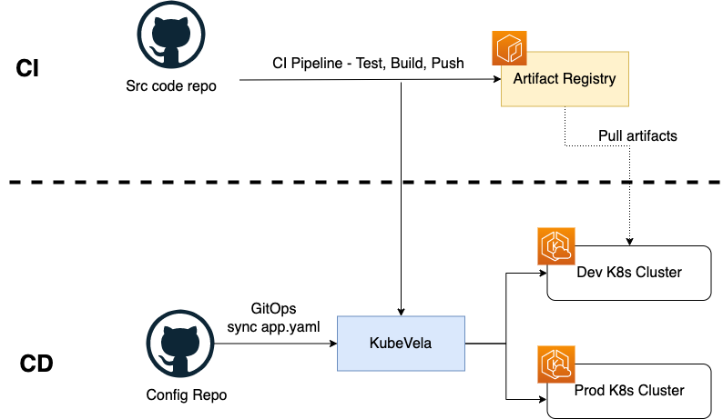

## Env Setup


## GitOps Pipeline



## GitOps Pipeline


## Workshop Structure

1. Setup existing environment
1.1 Setup existing On-Prem env - **does it have to be on K8s if we are going to containerize the apps???**
1.2 Setup Dev and Prod K8s clusters on EKS using EKS BP, this includes the addons like Observability, ArgoCD, KubeVela
2. **Containerization???**
2.1 Containerize Node and Go apps
2.2 Containerize Java app using App2Container
3. Setup CI process
3.1 Build and push Node image to ECR
3.2 Build and push Go image to ECR
3.3 Build and push Java image to ECR
4. Setup CD process
4.1 Configure KubeVela for each app - traits, policies, workflow
4.2 Deploy the apps with vela up
5. Configure KubeVela workflow to demonstrate deployment orchestration
6. Configure KubeVela UX and enable Observability (Grafana, Prometheus)

## Solution Overview

To address the above problems, this is a solution that makes the S3 presigned URLs more restricted resources. It allows users to specify the TTL (time-to-live) and also the allowed download attempts for the presigned URLs.

The solution uses DynamoDB for data persistence. Upon requests for generating the presigned URLs, users can specify following parameters in the request and DynamoDB is used to store those information and update the states of the URLs and associated authorizations when the URLs are accessed.

1. Set a shorter TTL to expire the resource early
2. Customise the number of allowed attempts for the specific resource 

## High-level architecture


## Implementation

_AWS CDK_ is used as the _IAC_ tool of choice and _TypeScript_ as the programing language for the implementation.

The _AWS DynamoDB_ table is used for storing information of a given presigned URL and the _Amazon S3_ bucket for holding objects. In DynamoDB table, _TimeToLive_ is enabled with attribute name _"ttl"_.

The logics are handled by the two Lambda functions: `urlLambda` and `edgeLambda`

`urlLambda` is fronted with _Amazon API Gateway_. This part of infrastructure is responsible for following tasks:
1. Generate the presigned URLs
2. Save the record in DynamoDB with the custom TTL and numAccesses (if any, otherwise will use the default value)

```ts
  // TTL param from API, default is 3600 (1 hour)
  let timeToLive = Math.floor(Date.now() / 1000) + 3600;

  const { ttl } = event.queryStringParameters;
  if (ttl) {
    const ttl_num: number = +ttl; 
    timeToLive = Math.floor(Date.now() / 1000) + ttl_num;  
  }

  // numAccesses param from API, default is 1
  let numAcc = 1;

  const { numAccesses } = event.queryStringParameters;
  if (numAccesses) {
    const numAccesses_num: number = +numAccesses; 
    numAcc = numAccesses_num;
  }

  try {
    await saveRecord(uriHash, timeToLive, numAcc);
  } catch (e) {
    return internalServerErrorResponse;
  }
```

After `urlLambda` is done with above 2 tasks, it will return presigned URL with the CloudFront domain. This will allow the other Lambda function (_Lambda@Edge_) `edgeLambda` that is associated with the _CloudFront Distribution_ to run whenever the URL is requested.

The _Lambda@Edge_ `edgeLambda` does the validation of the presigned URL with following logics and decide if the request should be allowed or not.
1. Is the URL existing? Or expired (over TTL)?
2. Does the URL still have remaining allowed download attempts?

```ts
  try {
    // This Lambda will try to read the DynamoDB to validate the URL record that is requested.
    const item = await getItem(uriHash);

    // Firstly, it checks if the URL is expired. If yes, return "URL not found, or expired"
    if (!item) {
      return notExistingResponse;
    }

    // Then, it checks if this URL still got allowed attempts, and returns the presigned URL if yes
    const originalItem = unmarshall(item || {});

    let numAccesses_num: number = +originalItem.numAccesses; 
    if(numAccesses_num == 0) {
      return forbiddenResponse;
    }

    // The attempts decrements
    numAccesses_num--;
    
    let timeToLive: number = +originalItem.ttl;

    await updateRecord(uriHash, timeToLive, numAccesses_num);
  } catch (e) {
    return internalServerErrorResponse;
  }

  return request;
```
## Deployment

Before deployment, it is important to ensure you have your AWS environment variables setup correctly and the AWS profile is pointing to the correct region that is expected to deploy this solution.

- run `npm run cdk bootstrap`
- run `npm run cdk deploy`

## Test

After deployment, we can run through the following commands for testing. 

Upload an object to the `assets-bucket` with below command.
```cmd
aws s3 cp test.png s3://<assetsBucketName>
```

With the object uploaded, we can request the presigned URL.

```cmd
curl -XGET 'https://<getPresignedUrlEndpoint>?key=test.png'
```

You can also specify the TTL value and allowed number of attempts in the API parameters. Following example is a request of the presigned URL that comes with a TTL of 300 seconds (5 minutes) and 3 allowed attempts.

```cmd
curl -XGET 'https://<getPresignedUrlEndpoint>?key=test.png&ttl=300&numAccesses=3'
```

After `urlLambda` execution is completed, a record is saved in DynamoDB as below.


In this example with this presigned URL, you can access the S3 object with 3 attempts in 5 minutes time.